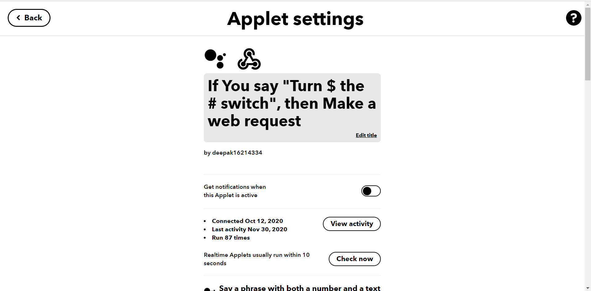
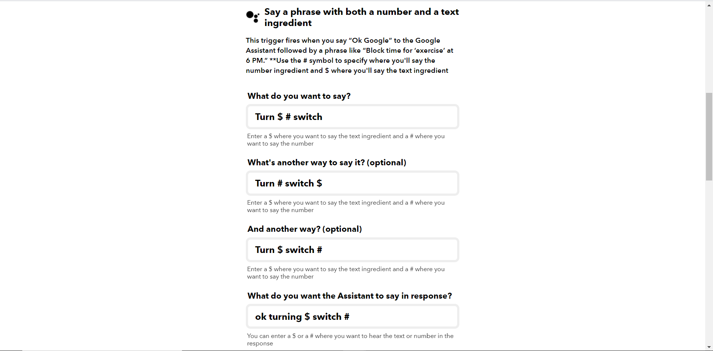
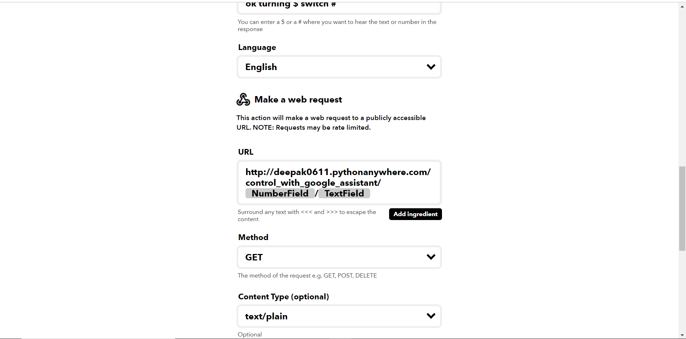

# Home-Automation-Project

## Features of the project
  - Control Switches over Internet
  - Schedule switches to ON/OFF automatically at a fixed time interval
  - Control switches with your google assistant over internet
  - Let switches to ON/OFF depending on the temperature of the room
  - Let you know the temperature & humidity of the room
  - Let you know whether hardware device(NodeMCU) is connected to internet or not
  - Authentication System
  - Sending greeting email to user email when user creates an account
  

## Software & Hardware Used
  - HTML,CSS & Javascript
  - Django
  - IFTTT
  - Arduino
  - NodeMCU ESP8166
  - 4 channel relay module
  - DHT11 temperature & humidity sensor
  - Bread board & jumper wires


## Project Members
  - Arduino code :- Aniket Kumar ( [Github](https://github.com/Aniket4639) , [LinkedIn](https://www.linkedin.com/in/aniket-kumar-a0ab751ba) )
  - Frontend & backend code :- Deepak Kumar Singh(me) ( [Github](https://github.com/deepak0611) , [LinkedIn](https://www.linkedin.com/in/deepak-kumar-00a846171/) )
  - Hardware Part :- Gunjan Sharma ( [Github](http://github.com/Gunjan1235) , [LinkedIn](https://www.linkedin.com/in/gunjan-sharma-13ba45174) )
  - IFTTT Part :- Vishal Babal ( [Github](http://github.com/vishalbabal817) , [LinkedIn](http://www.linkedin.com/in/vishal-babal-40b108173) )


## To run locally, do the usual:
1. Create a Python 3.7 virtualenv
2. Install dependencies:
  ```python
  pip install -r home_automation_api/requirements.txt
  ```
  3. Now go to directory where manage.py file is and run the server.
  ```python
  python manage.py runserver
  ```
  4. That's it. Enjoy!
  


>**Website is currently hosted on** ~~http://deepak0611.pythonanywhere.com/~~


## Screenshots


<details>
  <summary>Home Page</summary>
  
  
  
   
</details>
<details>
  <summary>Login Page</summary>
  
</details>
<details>
  <summary>Signup Page</summary>
  
  
</details>
<details>
  <summary>Received Email</summary>
  
</details>

<details>
  <summary>API data</summary>
  
  
</details>


<details>
  <summary>IFTTT Setup</summary>
  
  
  
</details>


